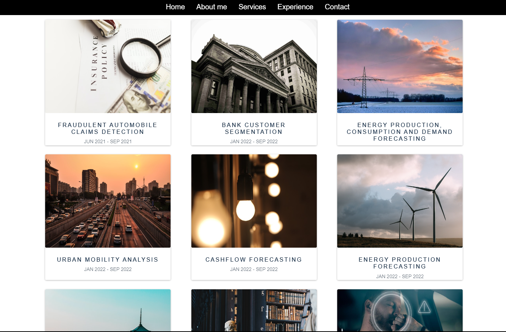

    

<h1 align="center">
  
</h1>

<h3 align="center">Full-Stack Data Scientist driving multimillion-dollar impacts</h3>

  

  Currently building powerful Large Language Models (LLMs) and learning more about MLOps and AWS SageMaker
  

  

    
    
    
    
  

  <a href = "https://mydatalchemist.com">
    
<b>Click here to explore my professional work</b>

    
  </a>

<h2>Projects</h2>

Here's a selection of recent open-source projects I've contributed to:

- <b>Managed a user adoption analysis project, determining what drives user engagement. </b>
[View Project](https://github.com/SalaheddineAD/user-adoption-analysis)

- <b>A microservices-based platform for dynamic, real-time data participation and analysis.</b>
[View Project](https://github.com/SalaheddineAD/microservices-based-data-participation-and-analysis)

- <b>Developed an NLP-based chatbot to interact with users and provide instant responses.</b>
[View Project](https://github.com/SalaheddineAD/chatbot-nlp)

- <b>Created A data consumption forecasting project using LSTM and GRU.</b>
[View Project](https://github.com/SalaheddineAD/energy-consumption-forecasting)

- <b>A data pipeline analyzing LinkedIn job postings using Apache Kafka, Spark, deployed on AWS.</b>
[View Project](https://github.com/SalaheddineAD/job-analytics)

<h2 align="left">Languages and Tools:</h2>

                       

